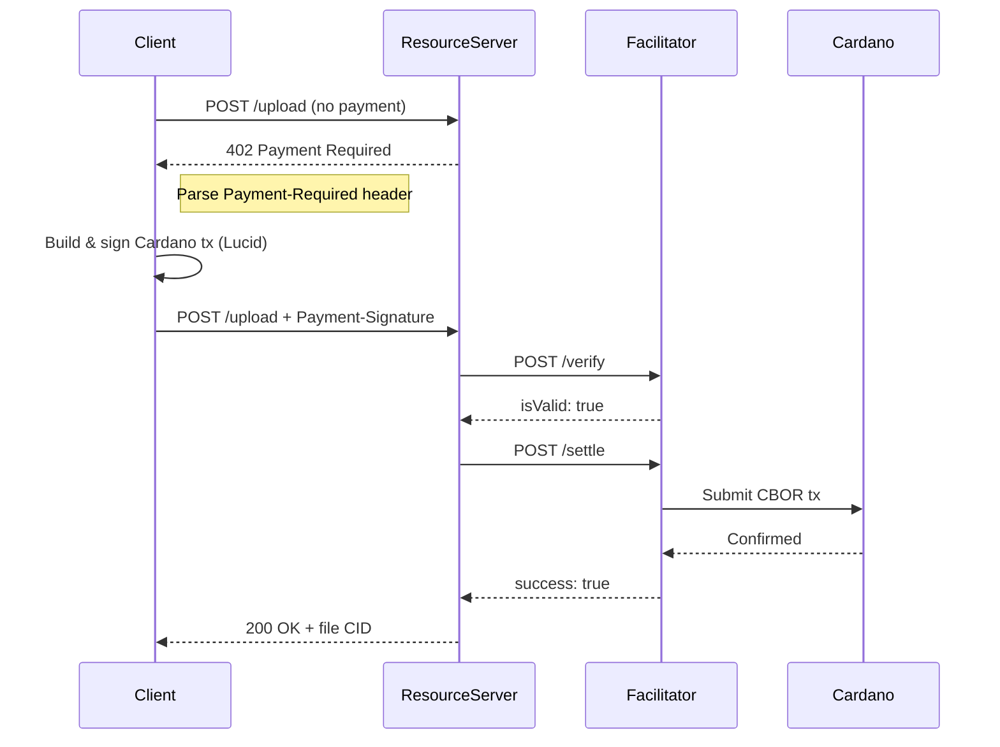

# Phase 9: Documentation & Publishing - Research

**Researched:** 2026-02-12
**Domain:** Documentation tooling, npm publishing, open-source project setup
**Confidence:** HIGH

## Summary

Phase 9 is the final phase of x402-fac, transforming a production-ready codebase into a publishable open-source project. The work divides into four distinct domains: (1) API documentation via OpenAPI/Swagger generated from existing Fastify route schemas using @fastify/swagger + fastify-type-provider-zod, (2) project documentation (README, deployment guide, architecture diagrams, positioning document), (3) npm package publishing with proper ESM-only TypeScript configuration and a separate SDK entry point, and (4) open-source governance files (LICENSE, CONTRIBUTING.md, SECURITY.md).

The project already has substantial documentation: `docs/operations.md` (runbook), `examples/README.md` (client walkthrough), and `examples/client.ts` (working example). The existing Zod schemas in route handlers can be leveraged for automatic OpenAPI generation. The main gap is that the tsup build config only exposes a single entry point (`src/index.ts`, the server), while the SDK barrel (`src/sdk/index.ts`) needs its own entry point for npm consumers.

**Primary recommendation:** Use @fastify/swagger v9 + fastify-type-provider-zod v5+ for runtime OpenAPI generation from existing Zod schemas. Publish as a single npm package with two entry points (server + SDK). Use Apache-2.0 license to match the upstream x402 protocol. Write all diagrams in Mermaid (GitHub renders natively). Keep documentation lean -- this is a focused single-developer project, not an enterprise product.

## Standard Stack

### Core
| Library | Version | Purpose | Why Standard |
|---------|---------|---------|--------------|
| @fastify/swagger | ^9.x | OpenAPI spec generation from route schemas | Official Fastify plugin, generates spec at runtime from Zod schemas |
| @fastify/swagger-ui | ^5.x | Swagger UI served at /docs | Official companion to @fastify/swagger, serves interactive API docs |
| fastify-type-provider-zod | ^5.x | Bridge between Zod schemas and @fastify/swagger | Zod 4 + Fastify 5 support, jsonSchemaTransform converts Zod to JSON Schema |

### Supporting
| Library | Version | Purpose | When to Use |
|---------|---------|---------|-------------|
| Mermaid (markdown) | N/A | Architecture diagrams in docs | GitHub renders natively in .md files |

### Alternatives Considered
| Instead of | Could Use | Tradeoff |
|------------|-----------|----------|
| @fastify/swagger (runtime) | Standalone openapi.yaml | Runtime generation uses existing Zod schemas directly; standalone requires manual maintenance of a second schema source |
| Mermaid | D2, PlantUML | D2 produces nicer output but requires external renderer; Mermaid renders inline on GitHub with zero tooling |
| fastify-type-provider-zod | fastify-zod-openapi | fastify-zod-openapi is more feature-rich but adds zod-openapi dependency chain; type-provider-zod is simpler and sufficient |

**Installation:**
```bash
pnpm add @fastify/swagger @fastify/swagger-ui
pnpm add -D fastify-type-provider-zod
```

Note: fastify-type-provider-zod may be a runtime dependency depending on whether `jsonSchemaTransform` is used at server start. Verify during implementation -- if `validatorCompiler` and `serializerCompiler` are used at runtime, it must be a production dependency.

## Architecture Patterns

### Documentation File Structure
```
/                          # Project root
  README.md               # Main README (getting started, badges, overview)
  LICENSE                  # Apache-2.0
  CONTRIBUTING.md          # Dev setup, coding standards, PR process
  SECURITY.md              # Responsible disclosure process
  docs/
    operations.md          # Existing runbook (already complete)
    architecture.md        # New: component diagram, data flow, EUTXO model
    api-reference.md       # New: endpoint reference with examples (or just /docs UI)
    deployment.md          # New: consolidated deployment guide (Docker + testnet)
    cardano-x402.md        # New: positioning document (why Cardano for x402)
    sdk-guide.md           # New: SDK usage guide for resource server builders
  examples/
    README.md              # Existing: client example walkthrough
    client.ts              # Existing: working example client
```

### Pattern 1: Runtime OpenAPI Generation from Existing Zod Schemas

**What:** Register @fastify/swagger before routes, set `transform: jsonSchemaTransform`, and the plugin generates an OpenAPI 3.0.3 spec from the Zod schemas already defined in route handlers.

**When to use:** When you already have Zod schemas on routes (which this project does on /verify, /settle, /status).

**Approach for this project:**
The current route handlers use `VerifyRequestSchema.safeParse(request.body)` manually rather than Fastify's native schema validation. To get @fastify/swagger to generate docs, the routes need to declare schemas in Fastify's route options (the `schema` property). Two approaches:

1. **Refactor routes to use Fastify native schema** -- Change routes to use `schema: { body: VerifyRequestSchema, response: { 200: VerifyResponseSchema } }` in route options. @fastify/swagger picks these up automatically. This is cleaner but requires route refactoring.

2. **Write a static OpenAPI YAML** -- Manually author an OpenAPI spec based on the existing Zod schemas. No code changes needed, but creates a maintenance burden (spec can drift from code).

3. **Hybrid: Add schema declarations alongside existing safeParse** -- Add `schema` property to route options for documentation purposes, keep manual safeParse for the actual validation logic. @fastify/swagger generates docs from the declared schemas. This preserves existing behavior while adding docs.

**Recommendation:** Approach 3 (hybrid). Add `schema` declarations to existing route options for documentation generation. Keep existing `safeParse()` calls for actual validation. This requires the least refactoring and avoids introducing new validation behavior in the final phase.

**Example:**
```typescript
// In src/routes/verify.ts -- add schema for documentation
import { z } from 'zod';

fastify.post(
  '/verify',
  {
    schema: {
      description: 'Verify a Cardano payment transaction',
      tags: ['Facilitator'],
      body: VerifyRequestSchema,
      response: {
        200: VerifyResponseSchema,
      },
    },
    config: {
      rateLimit: { max: fastify.config.rateLimit.sensitive, timeWindow: fastify.config.rateLimit.windowMs },
    },
  },
  async (request, reply) => {
    // Existing handler unchanged -- still uses safeParse internally
  }
);
```

### Pattern 2: Dual Entry Points for npm Package

**What:** Configure tsup to build two entry points: the server (`src/index.ts`) and the SDK (`src/sdk/index.ts`). The SDK entry is what resource server developers import.

**When to use:** When a package serves both as a standalone server and as a library.

**Example tsup.config.ts:**
```typescript
import { defineConfig } from 'tsup';

export default defineConfig({
  entry: {
    index: './src/index.ts',
    sdk: './src/sdk/index.ts',
  },
  format: ['esm'],
  dts: true,
  clean: true,
  sourcemap: true,
  tsconfig: './tsconfig.build.json',
});
```

**Example package.json exports:**
```json
{
  "type": "module",
  "exports": {
    ".": {
      "import": "./dist/index.js",
      "types": "./dist/index.d.ts"
    },
    "./sdk": {
      "import": "./dist/sdk.js",
      "types": "./dist/sdk.d.ts"
    }
  }
}
```

This lets resource servers do:
```typescript
import { FacilitatorClient, createPaymentGate } from 'x402-fac/sdk';
```

### Pattern 3: Mermaid Architecture Diagrams

**What:** Embed Mermaid diagram code in markdown files. GitHub renders these inline with zero tooling.

**When to use:** Always for GitHub-hosted projects. No build step, no image files to maintain.

**Example (sequence diagram for x402 payment flow):**
````markdown

````

### Anti-Patterns to Avoid
- **Duplicating the spec**: Do NOT maintain both a runtime-generated OpenAPI spec AND a static YAML. Pick one source of truth.
- **Over-documenting internals**: The README should focus on usage (how to run, how to integrate), not implementation details. Internal architecture docs are separate.
- **Publishing test files**: Use `files` whitelist in package.json. Never publish `tests/`, `coverage/`, `.planning/`, config secrets.
- **README feature dump**: Avoid listing every feature. Focus on the "30-minute quick start" scenario.

## Don't Hand-Roll

| Problem | Don't Build | Use Instead | Why |
|---------|-------------|-------------|-----|
| OpenAPI spec | Manual YAML from scratch | @fastify/swagger + jsonSchemaTransform | Zod schemas already exist; auto-generation prevents spec drift |
| API docs UI | Custom HTML docs page | @fastify/swagger-ui | Interactive, auto-generated, zero maintenance |
| Diagram images | Exported PNGs/SVGs | Mermaid in markdown | GitHub renders natively, diagrams stay versioned with code |
| npm prepublish checks | Custom scripts | `prepublishOnly` + `files` whitelist | Standard npm patterns, well-understood |

**Key insight:** This phase is about connecting existing pieces (Zod schemas, working routes, existing docs) with standard tooling, not building new features.

## Common Pitfalls

### Pitfall 1: Schema Drift Between Code and Docs
**What goes wrong:** If using a static OpenAPI YAML, it falls out of sync with the actual route behavior after future code changes.
**Why it happens:** Two sources of truth -- the code and the spec file -- diverge silently.
**How to avoid:** Use runtime generation from the same Zod schemas that validate requests. The spec is always current.
**Warning signs:** API consumers report that documented behavior doesn't match actual behavior.

### Pitfall 2: Publishing Secrets in npm Package
**What goes wrong:** Config files, `.planning/` docs, or test fixtures containing API keys end up in the published package.
**Why it happens:** Using `.npmignore` (blocklist) instead of `files` (allowlist) in package.json. Easy to forget to exclude new directories.
**How to avoid:** Use `files` array in package.json as a strict allowlist. Run `npm pack --dry-run` before publishing to verify contents.
**Warning signs:** Published package size is unexpectedly large.

### Pitfall 3: ESM-Only Package Gotchas
**What goes wrong:** Consumers using CommonJS or older Node.js versions can't import the package.
**Why it happens:** ESM-only packages with `"type": "module"` are not compatible with `require()`.
**How to avoid:** This is intentional -- the project requires Node 20+. Document this clearly in package.json `engines` field and README prerequisites. The project already has `"type": "module"` and `"engines": { "node": ">=20" }`.
**Warning signs:** Users filing issues about "Cannot use import statement outside a module."

### Pitfall 4: Missing or Incorrect Type Exports
**What goes wrong:** TypeScript consumers can't find types when importing from the package.
**Why it happens:** `exports` map in package.json doesn't include `"types"` condition, or `dts: true` is missing from tsup config.
**How to avoid:** Always include `"types"` in each exports entry. Verify with `npm pack --dry-run` that `.d.ts` files are included. Test import in a fresh project.
**Warning signs:** TypeScript errors like "Could not find a declaration file for module 'x402-fac/sdk'."

### Pitfall 5: @fastify/swagger Not Seeing Routes
**What goes wrong:** Swagger UI shows no endpoints or missing endpoints.
**Why it happens:** @fastify/swagger must be registered BEFORE routes. If registered after, it can't discover route schemas.
**How to avoid:** Register @fastify/swagger as one of the first plugins in `createServer()`, before any route plugins.
**Warning signs:** `/docs` page loads but shows zero endpoints.

### Pitfall 6: fastify-type-provider-zod + Zod 4 Import Path
**What goes wrong:** Schema transformation fails or produces incorrect output.
**Why it happens:** Zod 4 changed its import path. `fastify-type-provider-zod` v5+ expects Zod imported from `zod` (v4) not `zod/v4`. The project already uses `import { z } from 'zod'` with Zod 4.3.6, so this should be fine.
**How to avoid:** Verify the import path matches what fastify-type-provider-zod expects. The project's existing `import { z } from 'zod'` pattern is correct.
**Warning signs:** Runtime errors about missing Zod methods or incorrect schema output.

## Code Examples

### OpenAPI Setup with @fastify/swagger + Zod

```typescript
// In src/server.ts -- register swagger before routes
// Source: https://github.com/fastify/fastify-swagger + https://github.com/turkerdev/fastify-type-provider-zod
import swagger from '@fastify/swagger';
import swaggerUi from '@fastify/swagger-ui';
import {
  jsonSchemaTransform,
  serializerCompiler,
  validatorCompiler,
} from 'fastify-type-provider-zod';

// Set compilers (needed for jsonSchemaTransform)
server.setValidatorCompiler(validatorCompiler);
server.setSerializerCompiler(serializerCompiler);

// Register swagger BEFORE routes
await server.register(swagger, {
  openapi: {
    openapi: '3.0.3',
    info: {
      title: 'x402 Cardano Payment Facilitator',
      description: 'Cardano x402 payment facilitator API for verifying and settling blockchain payments.',
      version: '1.0.0',
      license: { name: 'Apache-2.0', url: 'https://www.apache.org/licenses/LICENSE-2.0' },
    },
    servers: [
      { url: 'http://localhost:3000', description: 'Development' },
    ],
    tags: [
      { name: 'Health', description: 'Server health and capabilities' },
      { name: 'Facilitator', description: 'Payment verification and settlement' },
      { name: 'Storage', description: 'File upload and download (reference implementation)' },
    ],
  },
  transform: jsonSchemaTransform,
});

await server.register(swaggerUi, {
  routePrefix: '/docs',
});

// Then register routes as before...
```

### Package.json for npm Publishing

```json
{
  "name": "x402-fac",
  "version": "1.0.0",
  "description": "Cardano x402 payment facilitator with resource server SDK",
  "type": "module",
  "exports": {
    ".": {
      "import": "./dist/index.js",
      "types": "./dist/index.d.ts"
    },
    "./sdk": {
      "import": "./dist/sdk.js",
      "types": "./dist/sdk.d.ts"
    }
  },
  "files": [
    "dist/",
    "LICENSE",
    "README.md"
  ],
  "engines": {
    "node": ">=20"
  },
  "scripts": {
    "prepublishOnly": "pnpm build"
  }
}
```

### tsup.config.ts with Dual Entry Points

```typescript
import { defineConfig } from 'tsup';

export default defineConfig({
  entry: {
    index: './src/index.ts',
    sdk: './src/sdk/index.ts',
  },
  format: ['esm'],
  dts: true,
  clean: true,
  sourcemap: true,
  tsconfig: './tsconfig.build.json',
});
```

### SECURITY.md Template

```markdown
# Security Policy

## Supported Versions

| Version | Supported |
|---------|-----------|
| 1.x.x  | Yes       |

## Reporting a Vulnerability

If you discover a security vulnerability in x402-fac, please report it responsibly.

**Do NOT open a public GitHub issue for security vulnerabilities.**

### How to Report

1. Email: [security contact email]
2. Include:
   - Description of the vulnerability
   - Steps to reproduce
   - Potential impact
   - Suggested fix (if any)

### Response Timeline

- **Acknowledgment:** Within 48 hours
- **Initial assessment:** Within 5 business days
- **Fix timeline:** Depends on severity

### Disclosure Policy

We follow coordinated disclosure. We will:
1. Confirm the vulnerability
2. Develop and test a fix
3. Release the fix
4. Credit the reporter (unless they prefer anonymity)
5. Publicly disclose after the fix is available

## Scope

This policy covers the x402-fac repository and its published npm packages.

## Known Security Properties

- Blockfrost API keys are never logged or exposed in error responses
- All inputs validated with Zod schemas
- Rate limiting on all public endpoints
- Request body size limits (50KB default, 10MB for uploads)
- Production Docker image runs as non-root user
- Redis authentication supported and recommended
```

## State of the Art

| Old Approach | Current Approach | When Changed | Impact |
|--------------|------------------|--------------|--------|
| Manual OpenAPI YAML | Runtime generation from route schemas | @fastify/swagger v9 (2024) | Spec stays in sync with code automatically |
| package.json `main` + `types` | `exports` map with conditions | Node 16+ (2021), TypeScript 5.x (2023) | Proper ESM + types resolution for consumers |
| D2 or exported images for diagrams | Mermaid in markdown | GitHub native support (2022) | Zero tooling, diagrams render inline |
| .npmignore (blocklist) | `files` field (allowlist) | Always available, now standard | Prevents accidental secret publication |
| CJS + ESM dual package | ESM-only | Node 20 LTS mainstream (2024) | Simpler config, no dual-package hazard |

**Deprecated/outdated:**
- `package.json` `main` and `types` top-level fields: Still work but `exports` is the modern approach. Keep `main` and `types` for backward compatibility with older tools, but `exports` takes precedence.
- `module` field in package.json: Not standard, was a bundler convention. Unnecessary for ESM-only packages.

## npm Publishing Decision: Single Package vs SDK-Only

### Option A: Publish the whole project (server + SDK)
- **Pro:** Single `npm install x402-fac` gives you everything
- **Con:** Server dependencies (fastify, ioredis, @sentry/node) pulled in even if you only want the SDK
- **Con:** Resource server builders only need the SDK, not the server

### Option B: Publish SDK as a separate package
- **Pro:** Lean dependency tree for resource server builders
- **Con:** Requires monorepo or separate package management

### Option C: Publish whole project, document SDK entry point
- **Pro:** Simple single-package setup, users import `x402-fac/sdk` for just the SDK types and client
- **Con:** Extra dependencies installed even if unused

**Recommendation:** Option C for v1. The SDK (`FacilitatorClient`, `createPaymentGate`, etc.) has minimal internal dependencies (just Zod for schema validation). Resource servers will have Zod anyway. The extra server dependencies in node_modules are a minor inconvenience vs the complexity of maintaining a monorepo. If the SDK gains traction, extract it to a separate package later.

**IMPORTANT:** The SDK imports from `../settle/types.js` and `../verify/types.js` (Zod schemas for request/response validation). The tsup build with `sdk` entry point will tree-shake and bundle only what the SDK actually uses -- but verify this during implementation. The SDK should NOT pull in Fastify, ioredis, or @sentry/node in its bundle.

## License Decision

**Recommendation: Apache-2.0**

Rationale:
1. **x402 protocol itself uses Apache-2.0** (the Coinbase x402 repository). Using the same license as the upstream protocol avoids compatibility questions.
2. **Patent grant**: Apache-2.0 includes an explicit patent grant, which is relevant for a payment protocol that could potentially involve patented methods. MIT is silent on patents.
3. **Cardano ecosystem precedent**: Lucid Evolution uses MIT, but the x402 protocol alignment is more important here. Apache-2.0 is MIT-compatible (Apache-2.0 code can be used in MIT projects, though not vice versa).
4. **Modification tracking**: Apache-2.0 requires marking modified files, which provides better provenance for a financial protocol.
5. **2025 adoption**: Apache-2.0 and MIT are the two most popular open-source licenses. Apache-2.0 is standard for infrastructure and protocol implementations.

## Diagrams Needed

The following Mermaid diagrams should be created for `docs/architecture.md`:

1. **Component diagram**: Shows facilitator server, SDK, resource server, client, and their relationships
2. **Payment flow sequence diagram**: The full x402 cycle (402 -> build tx -> sign -> verify -> settle -> confirmed)
3. **Internal architecture diagram**: Chain provider, UTXO cache, Redis, Blockfrost, verification pipeline, settlement pipeline
4. **Data flow diagram**: How a transaction moves through the system (CBOR in -> deserialize -> 10 checks -> submit -> poll -> confirm)

All diagrams in Mermaid syntax, embedded in markdown files. GitHub renders these natively.

## README Structure

Based on successful open-source project READMEs for Cardano/blockchain tooling:

```
# x402 Cardano Payment Facilitator

> One-line description

[Badges: CI status, npm version, license, Node version]

## What is x402?
Brief explanation (2-3 sentences)

## Features
Bullet list (5-7 items max)

## Quick Start
Step-by-step (clone, configure, run -- target: 5 minutes)

## Architecture
High-level diagram (Mermaid, embedded)

## API Reference
Link to /docs (Swagger UI) + brief endpoint table

## SDK for Resource Servers
Brief example of using FacilitatorClient + createPaymentGate

## Deployment
Link to docs/deployment.md + Docker one-liner

## Documentation
Links to docs/ files

## Contributing
Link to CONTRIBUTING.md

## License
Apache-2.0
```

## Open Questions

1. **npm package name availability**
   - What we know: Current name is `x402-fac`
   - What's unclear: Is `x402-fac` available on npm? Should it be `@x402/cardano-facilitator` or similar scoped name?
   - Recommendation: Check npm registry during implementation. Consider `x402-cardano` or a scoped package if `x402-fac` is taken or too terse.

2. **Swagger UI in production**
   - What we know: @fastify/swagger-ui serves interactive docs at /docs
   - What's unclear: Should /docs be available in production, or only development?
   - Recommendation: Enable in all environments. API docs don't expose secrets (the schemas are public). Optionally gate behind a config flag.

3. **CORS for Swagger UI**
   - What we know: CORS is restrictive in production (`origin: false`)
   - What's unclear: Swagger UI "Try It" feature needs CORS to work from browser
   - Recommendation: Swagger UI served from the same origin, so CORS is not an issue for the docs page itself. The "Try It" feature makes requests to the same server.

4. **fastify-type-provider-zod runtime vs devDependency**
   - What we know: `jsonSchemaTransform`, `validatorCompiler`, `serializerCompiler` are used at server startup
   - What's unclear: Whether the transform function is needed at runtime or only at build time
   - Recommendation: It IS a runtime dependency. Install as `dependencies`, not `devDependencies`. The transform runs when Fastify initializes swagger.

## Sources

### Primary (HIGH confidence)
- **Codebase inspection** -- All 45 source files, route handlers, SDK barrel, tsup config, package.json, Dockerfile
- **@fastify/swagger GitHub** -- https://github.com/fastify/fastify-swagger (v9.x for Fastify 5)
- **fastify-type-provider-zod GitHub** -- https://github.com/turkerdev/fastify-type-provider-zod (v5.x for Zod 4)
- **GitHub Mermaid support** -- https://docs.github.com/en/get-started/writing-on-github/working-with-advanced-formatting/creating-diagrams
- **x402 Coinbase repo** -- https://github.com/coinbase/x402 (Apache-2.0 license)

### Secondary (MEDIUM confidence)
- **ESM publishing guide** -- https://2ality.com/2025/02/typescript-esm-packages.html (package.json exports configuration)
- **License comparison** -- https://opensource.org/blog/top-open-source-licenses-in-2025 (Apache-2.0 vs MIT adoption)
- **fastify-type-provider-zod Zod 4 PR** -- https://github.com/turkerdev/fastify-type-provider-zod/pull/176 (Zod v4 support)

### Tertiary (LOW confidence)
- **npm package name availability** -- Not verified, needs runtime check during implementation

## Metadata

**Confidence breakdown:**
- Standard stack: HIGH - @fastify/swagger and fastify-type-provider-zod are the standard Fastify ecosystem tools, well-documented
- Architecture: HIGH - Based on direct codebase inspection; all patterns verified against existing code
- npm publishing: MEDIUM - ESM-only publishing is well-documented but the dual entry point approach needs verification with tsup tree-shaking
- License: HIGH - Apache-2.0 recommendation based on x402 protocol precedent and patent grant benefits
- Pitfalls: HIGH - Based on direct observation of current codebase state (e.g., tsup single entry, safeParse pattern)

**Research date:** 2026-02-12
**Valid until:** 2026-03-12 (stable tooling, unlikely to change rapidly)
