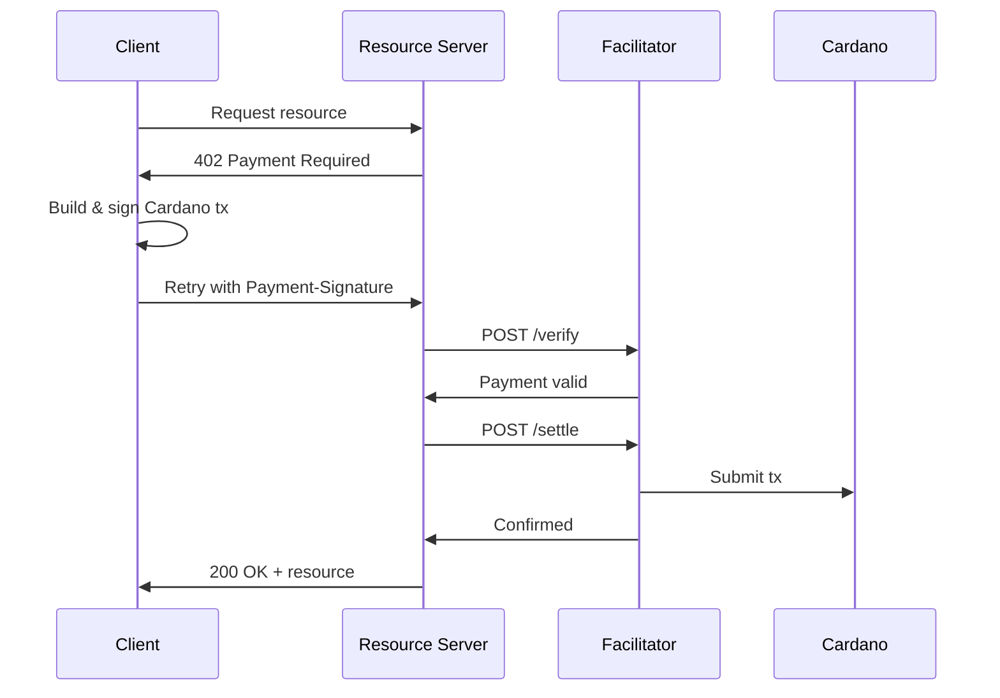

# x402 Cardano Payment Facilitator

> Cardano payment facilitator for the x402 protocol -- verify and settle blockchain payments for high-value operations.

[](https://github.com/anthropics/x402-fac/actions/workflows/ci.yml)
[](LICENSE)
[](https://nodejs.org)

## What is x402?

x402 is an HTTP-native payment protocol built on the HTTP 402 Payment Required status code. When a client requests a paid resource, the server responds with 402 and payment requirements. The client builds and signs a blockchain transaction, then retries the request with payment proof.

This facilitator handles the Cardano side: verifying signed transactions against payment requirements, settling them on-chain via Blockfrost, and confirming payment. Resource servers use the included SDK to gate access to any service behind x402 payments.

## Features

- **10-check verification pipeline** -- CBOR validity, scheme, network, token support, recipient, amount, min UTXO, witness, TTL, fee
- **On-chain settlement** -- Blockfrost submission with SHA-256 deduplication and confirmation polling
- **Multi-token support** -- ADA + stablecoins (USDM, DJED, iUSD)
- **Resource Server SDK** -- FacilitatorClient, payment gate middleware, 402 response builder
- **Reference implementation** -- Payment-gated file storage (upload with payment, download for free)
- **Interactive API docs** -- Swagger UI at `/docs`
- **Production-ready** -- Rate limiting, security headers, structured logging, Docker deployment
- **383+ tests** with 80%+ coverage thresholds

## Quick Start

### Prerequisites

- Node.js 20+
- pnpm (`npm install -g pnpm`)
- Docker (for Redis)
- Blockfrost API key ([blockfrost.io](https://blockfrost.io) -- free tier works)

### 1. Clone and install

```bash
git clone https://github.com/YOUR_USERNAME/x402-fac.git
cd x402-fac
pnpm install
```

### 2. Start dependencies

```bash
pnpm docker:up  # Starts Redis
```

### 3. Configure

```bash
cp config/config.example.json config/config.json
```

Edit `config/config.json`:
- Set `chain.blockfrost.projectId` to your Blockfrost preview testnet project ID
- Set `chain.facilitator.seedPhrase` to a 24-word Cardano wallet seed phrase

### 4. Start the server

```bash
pnpm dev
```

### 5. Verify

```bash
curl http://localhost:3000/health
curl http://localhost:3000/supported
```

Visit [http://localhost:3000/docs](http://localhost:3000/docs) for interactive API documentation.

## Architecture

The facilitator sits between resource servers and the Cardano blockchain. Resource servers delegate payment verification and settlement to the facilitator, keeping their own code payment-agnostic.



See [docs/architecture.md](docs/architecture.md) for detailed diagrams covering the verification pipeline, settlement flow, caching layers, and deployment topology.

## API Reference

| Method | Path | Description |
|--------|------|-------------|
| GET | `/health` | Server health and dependency status |
| GET | `/supported` | Supported chains, schemes, signer addresses |
| POST | `/verify` | Verify a signed Cardano transaction |
| POST | `/settle` | Submit and confirm payment on-chain |
| POST | `/status` | Check transaction confirmation status |
| POST | `/upload` | Payment-gated file upload (reference impl) |
| GET | `/files/:cid` | Download file by content ID (free) |

See interactive docs at `/docs` (Swagger UI) for request/response schemas and examples.

## SDK for Resource Servers

The SDK lets any Fastify resource server accept x402 payments with minimal code:

```typescript
import { FacilitatorClient, createPaymentGate } from 'x402-fac/sdk';

const facilitator = new FacilitatorClient({ baseUrl: 'http://localhost:3000' });
const gate = createPaymentGate({
  facilitator,
  payTo: 'addr_test1...',
  amount: '2000000',
  network: 'cardano:preview',
});

// Apply to any Fastify route
app.post('/api/protected', { preHandler: gate }, handler);
```

See [examples/README.md](examples/README.md) for a full working example of the 7-step x402 payment cycle.

## Deployment

Quick start with Docker Compose:

```bash
docker compose --profile production up -d
```

See [docs/deployment.md](docs/deployment.md) for the full deployment guide covering Docker configuration, Redis authentication, environment setup, and production checklist.

## Documentation

- [Architecture & Diagrams](docs/architecture.md)
- [Deployment Guide](docs/deployment.md)
- [Operations Runbook](docs/operations.md)
- [Cardano x402 Positioning](docs/cardano-x402.md)
- [Example Client](examples/README.md)

## Contributing

Contributions welcome! See [CONTRIBUTING.md](CONTRIBUTING.md) for development setup and PR guidelines.

## License

Apache-2.0 -- see [LICENSE](LICENSE).
