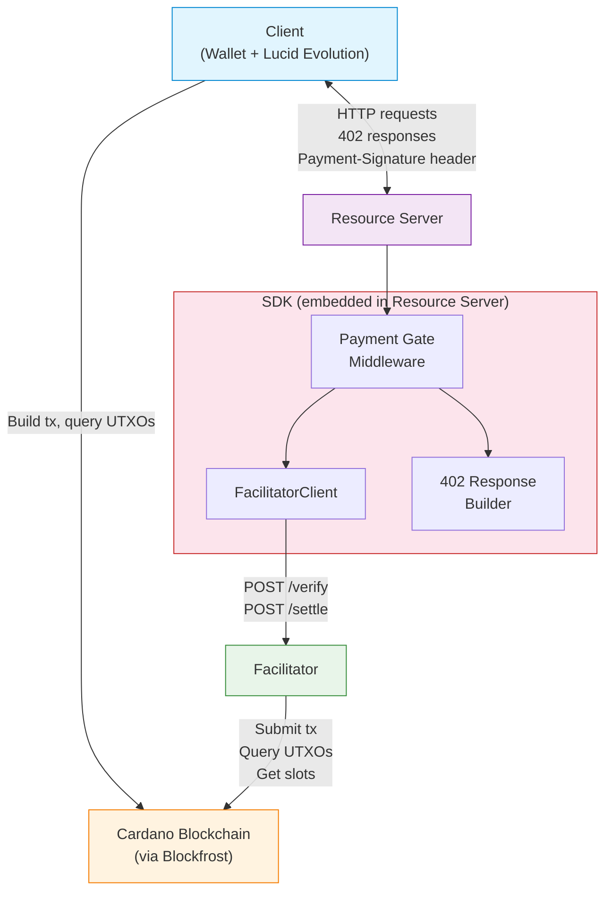
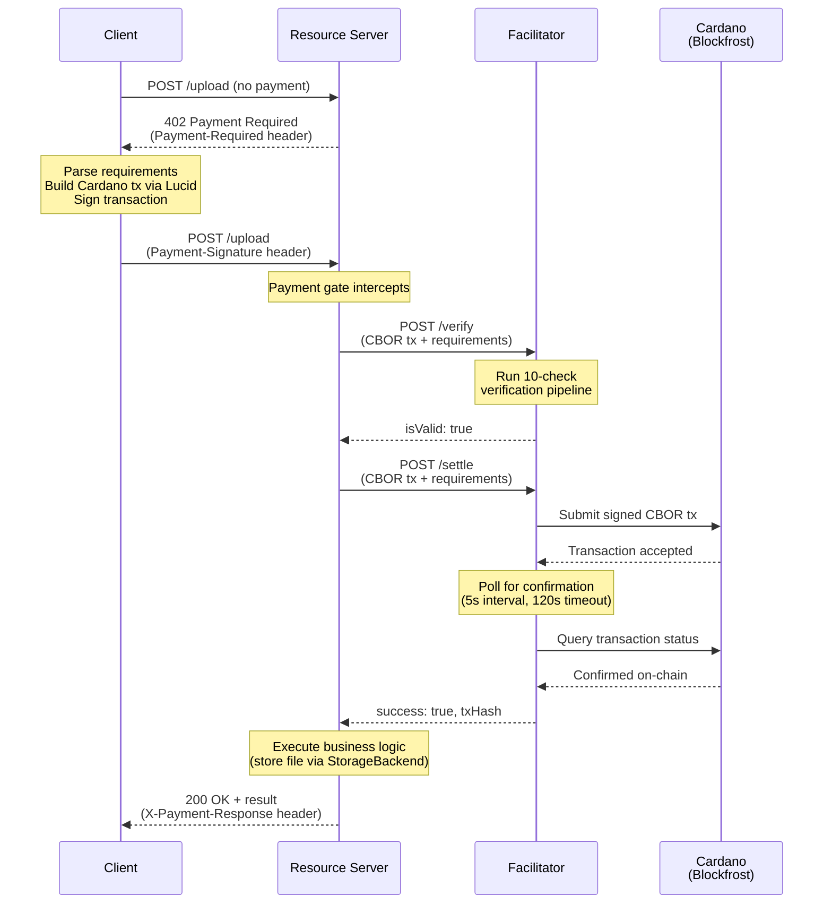
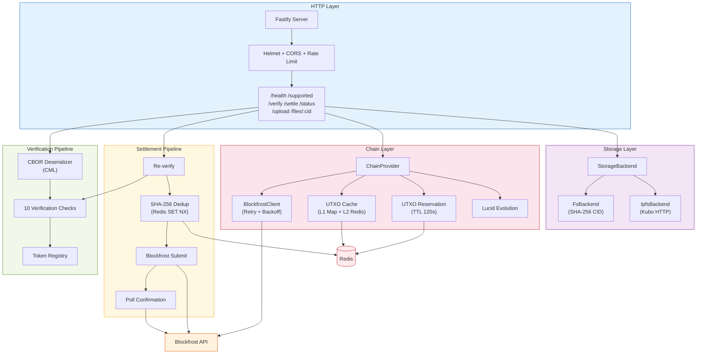
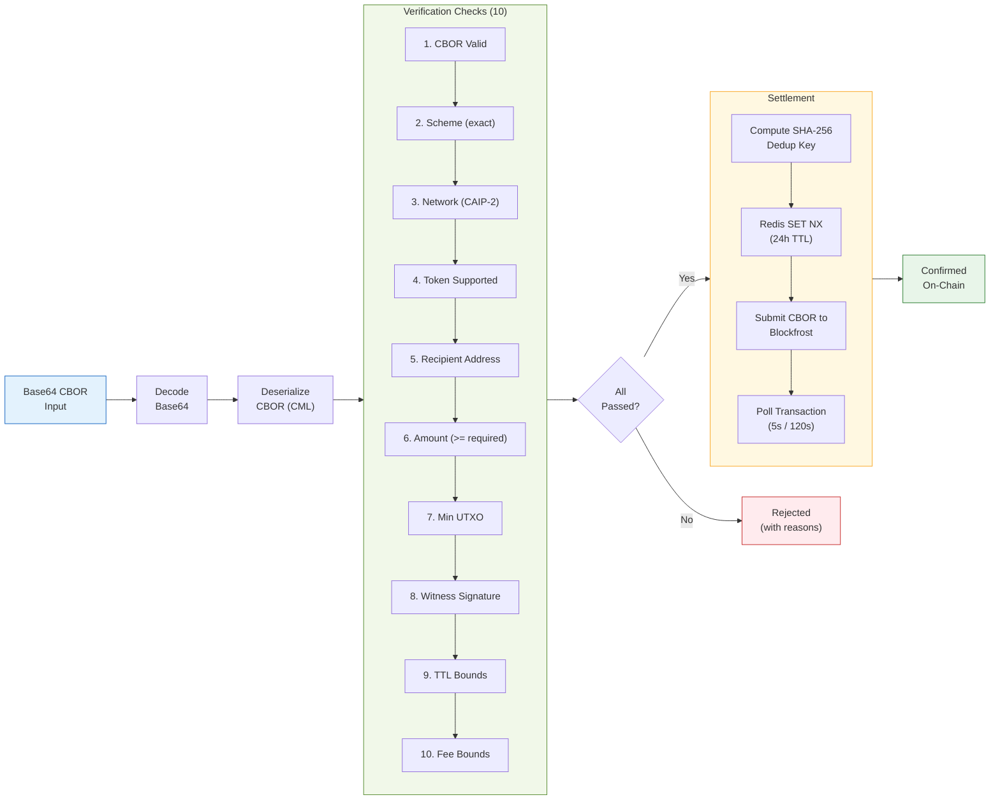

# Architecture

This document describes the x402 Cardano Payment Facilitator's architecture through four diagrams: how components relate, how payments flow, how the facilitator is structured internally, and how transaction data moves through the verification and settlement pipeline.

For operational procedures, see [operations.md](./operations.md).

---

## 1. Component Diagram

The x402 protocol involves four actors: the **Client** (a wallet that builds and signs Cardano transactions), the **Resource Server** (serves content behind a paywall), the **Facilitator** (verifies and settles payments), and the **Cardano blockchain** (accessed via Blockfrost).

The Resource Server embeds the SDK, which provides a payment gate middleware, a facilitator client for API calls, and a 402 response builder.

**Key relationships:**

- The Client never talks to the Facilitator directly. All communication is mediated by the Resource Server.
- The SDK's `FacilitatorClient` makes HTTP calls to the Facilitator's `/verify` and `/settle` endpoints.
- Both the Client and the Facilitator interact with the Cardano blockchain -- the Client to build transactions, the Facilitator to submit and query them.

---

## 2. Payment Flow

The full x402 payment cycle follows a challenge-response pattern. The Resource Server returns HTTP 402 with payment requirements, the Client builds and signs a Cardano transaction, and the Facilitator verifies and settles it on-chain.

**Key points:**

- The Client builds and signs the full Cardano transaction. The Facilitator never holds private keys.
- Verification and settlement are separate steps. The Resource Server can verify a payment without settling it (useful for pre-flight checks).
- UTXO-based replay protection is inherent -- each UTXO can only be spent once, so the same transaction cannot be submitted twice.
- Settlement is idempotent: a SHA-256 dedup key prevents double-submission even if the Resource Server retries.

---

## 3. Internal Architecture

The Facilitator is a Fastify application organized into five layers: HTTP, Verification, Settlement, Chain, and Storage. External dependencies are Redis (caching, dedup, reservation) and Blockfrost (Cardano API).

**Module responsibilities:**

- **HTTP Layer**: Request parsing, Zod validation, security headers, rate limiting, response formatting. Seven route plugins registered on the Fastify server.
- **Verification Pipeline**: Decodes base64 CBOR, deserializes via CML (Cardano Multiplatform Library), runs 10 ordered checks: CBOR validity, scheme, network, token support, recipient address, amount, min UTXO, witness signature, TTL, and fee.
- **Settlement Pipeline**: Re-verifies the transaction (catches stale submissions), computes a SHA-256 dedup key (Redis SET NX with 24h TTL), submits raw CBOR to Blockfrost, polls for on-chain confirmation at 5-second intervals with a 120-second timeout.
- **Chain Layer**: `ChainProvider` orchestrates Blockfrost queries (with retry and exponential backoff), a two-layer UTXO cache (in-memory L1 Map with LRU eviction, Redis L2 with TTL), UTXO reservation (Map + Redis, 120s TTL, crash recovery), and Lucid Evolution for Cardano primitives.
- **Storage Layer**: `StorageBackend` interface with two implementations -- `FsBackend` (local filesystem, SHA-256 content addressing) and `IpfsBackend` (Kubo HTTP API).

---

## 4. Data Flow

This diagram shows how a transaction moves through the verification and settlement pipeline, from base64 input to on-chain confirmation.

**Data transformation at each stage:**

1. **Input**: Base64-encoded string from the `Payment-Signature` header.
2. **Decode**: Raw CBOR bytes (Uint8Array).
3. **Deserialize**: Structured transaction object with body (inputs, outputs, fee, TTL), witnesses (vkey signatures), and metadata.
4. **Verification**: Each check examines one aspect -- scheme matching, network ID comparison (CAIP-2), token registry lookup, recipient address hex comparison, amount comparison (supports overpayment), min UTXO protocol check, witness presence, TTL window validation, fee bounds check. Pipeline uses a collect-all-errors pattern (all checks run even if earlier ones fail).
5. **Settlement**: SHA-256 hash of the CBOR bytes serves as a dedup key. Redis `SET NX` ensures idempotent submission. Blockfrost `/tx/submit` accepts raw CBOR. Polling queries `/txs/{hash}` until confirmed or timeout.
